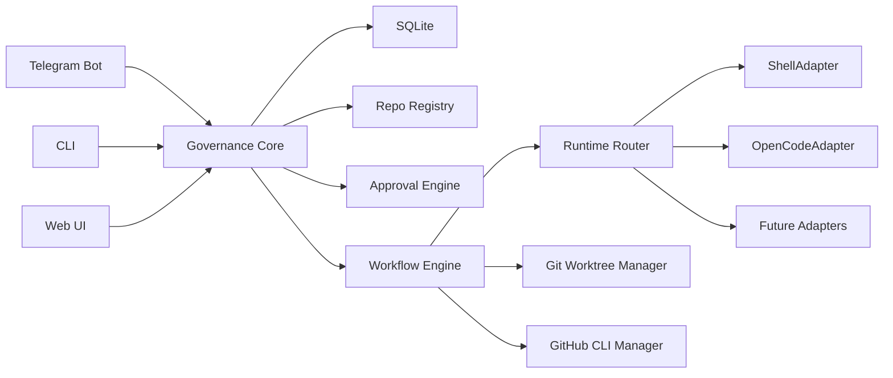

# Agent Governor

Agent Governor is a local-first governance/control plane for routing repository work to pluggable AI coding runtimes while keeping important actions behind owner approval.

It is not an AI coding agent, an IDE, a hosted SaaS, or a tool coupled to one runtime. It wires Telegram, a Web UI, a CLI, GitHub PRs, git worktrees, local config, SQLite, and runtime adapters together.

## Architecture



## Required Tools

- Node.js
- pnpm
- git
- GitHub CLI (`gh`)
- SQLite
- tmux optional
- OpenCode optional

## Install

```bash
pnpm install
pnpm agent setup
pnpm agent doctor
```

## Configuration

Copy `.env.example` to `.env` for secrets. Secrets should not be committed.

YAML config lives in `config/`:
- `app.yml` for paths, Telegram owner IDs, GitHub owner, and default branch
- `agents.yml` for runtime adapters and role routing
- `workflows.yml` for stages and approval gates
- `repos.yml` for registered repositories

## Telegram Setup

1. Create a bot with BotFather.
2. Set `TELEGRAM_BOT_TOKEN` in `.env` or `config/app.yml`.
3. Add owner Telegram IDs to `config/app.yml`.
4. Start the bot:

```bash
pnpm --filter @agent-governor/bot start
```

Implemented skeleton commands include `/repos`, `/selectrepo`, `/idea`, `/tasks`, `/status`, `/approve`, `/agents`, and `/roles`. Owner-gated commands are scaffolded and check owner identity before continuing.

## GitHub Setup

Authenticate the GitHub CLI:

```bash
gh auth login
```

The MVP GitHub manager wraps:
- `gh repo create`
- `gh repo clone`
- `gh pr create`
- `gh pr view`
- `gh pr merge`

## Runtime Setup

Runtime adapters are configured in `config/agents.yml`. The default `shell` adapter echoes the prompt file and is useful for proving the wiring. OpenCode is configured but disabled by default because command syntax should remain configurable.

Check a runtime:

```bash
pnpm agent test-runtime shell
```

## First Repo Setup

Register an existing local repo:

```bash
pnpm agent add-repo --name example --owner your-org --repo example --path ./repos/example/main --owners 123456789
pnpm agent list-repos
```

Repo creation and cloning wrappers exist in packages and will be wired into the Telegram workflow in the next phase.

## First Task Flow

1. Start the Telegram bot.
2. Run `/selectrepo example`.
3. Run `/idea add a health-check endpoint`.
4. Run `/tasks`.
5. Run `/status TASK-1`.
6. Owner approval can be recorded with `/approve TASK-1` or `pnpm agent approve TASK-1 --owner <telegram-id>`.

The workflow engine is intentionally still thin in this first scaffold. The schema, task store, approval engine, runtime interfaces, shell runtime, Git/GitHub wrappers, and UI shell are present for the next implementation pass.

## Safety Model

- Owner approval is required before implementation, PR open, and merge.
- Telegram merge actions must verify owner identity.
- Work should run in task worktrees, not directly on main.
- Branch names are sanitized through core helpers.
- Git helpers refuse direct pushes to `main` or `master`.
- Runtime commands run with the worktree as cwd.
- Actions are designed to be auditable in `audit_logs`.
- Secrets belong in `.env`.

## Troubleshooting

- `missing gh`: install GitHub CLI and run `gh auth login`.
- `missing telegram token`: set `TELEGRAM_BOT_TOKEN`.
- `Owner approval required`: add your Telegram ID to `config/app.yml` or per-repo owners.
- `Runtime not found`: check `config/agents.yml` and `pnpm agent list-runtimes`.

## Requirement Source

The initial product requirement is saved in `docs/initial-requirements.md`.
