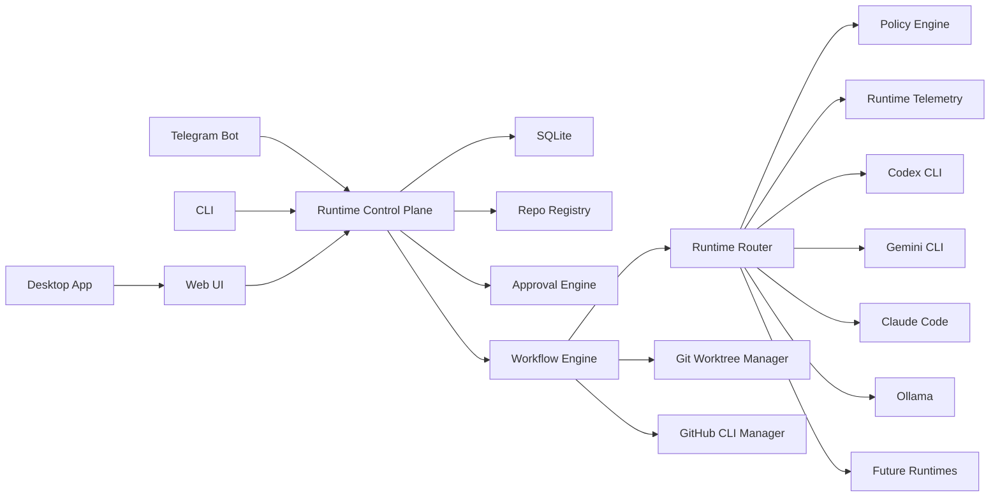

# Agent Governor

Agent Governor is the control plane for AI workers: a local-first AI runtime operating system that governs, routes, audits, and optimizes the runtimes a user already owns.

It is not another agent, model, IDE, hosted coding assistant, or multi-agent framework. It wires Telegram, a Web UI, a CLI, GitHub PRs, git worktrees, local config, SQLite, policies, telemetry, and runtime adapters together so Governor can decide who should run work, where it should run, what permissions are required, what it costs, and what fallback should be used.

The product direction is documented in [docs/product-direction.md](docs/product-direction.md).

## North Star

The user says:

```text
Build feature X
```

Governor decides:

```text
Who should do it?
Where should it run?
What permissions are required?
How much will it cost?
What is the fallback?
```

Every core feature should help govern, route, audit, or optimize AI work.

## Architecture



## Phase 1 Focus

The next product phase is runtime routing, not agent-swarm orchestration:

- Runtime registry for Claude Code, Gemini CLI, Codex CLI, Copilot, and Ollama.
- OpenAI-compatible runtime gateway at `/v1/chat/completions` shape, with Hermes compatibility.
- Policy routing by task type, capability, health, quota, cost, and fallback.
- Observability for every execution: runtime, latency, cost, success, failure, and task type.
- Governance hooks for approvals, audit, and permission boundaries.

The Phase 1 API surfaces are:

```text
GET /api/hermes/v1/governor/runtimes
GET /api/hermes/v1/governor/policy
GET /api/hermes/v1/governor/usage
GET /api/hermes/v1/governor/audit
```

## Before Opening The App

Do these steps first from a fresh clone. The app can open without them, but GitHub sync, clone, PR, and runtime routing will feel broken until the dependencies are in place.

### 1. Install System Tools

Required:

- Node.js 20+
- pnpm 9+
- git

Recommended:

- GitHub CLI (`gh`) for PR create/merge fallback
- Codex CLI, Gemini CLI, Claude Code, Ollama, Aider, or other local runtimes you want Governor to route to
- tmux optional

Check the basics:

```bash
node --version
pnpm --version
git --version
```

### 2. Install Workspace Dependencies

```bash
pnpm install
```

### 3. Create Local Environment

```bash
cp .env.example .env
```

At minimum, set the local database and GitHub defaults:

```bash
DATABASE_PATH=./data/agent-governor.sqlite
GITHUB_DEFAULT_BRANCH=main
GITHUB_OWNER=your-github-user-or-org
```

### 4. Configure GitHub Web SSO

Create a GitHub OAuth App before the first web run if you want the in-app browser OAuth flow:

```text
GitHub -> Settings -> Developer settings -> OAuth Apps -> New OAuth App
```

Use the callback URL shown on the first-run GitHub step. For local web development the default is:

```text
Homepage URL: http://localhost:3000
Authorization callback URL: http://localhost:3000/api/github/callback
```

For the desktop app, the local UI normally runs on `http://127.0.0.1:3002`, so the first-run page may show:

```text
Homepage URL: http://127.0.0.1:3002
Authorization callback URL: http://127.0.0.1:3002/api/github/callback
```

Then add the app credentials to `.env`:

```bash
GITHUB_CLIENT_ID=...
GITHUB_CLIENT_SECRET=...
GITHUB_OAUTH_SCOPES="repo read:user user:email read:org"
```

`GITHUB_OAUTH_REDIRECT_URI` is optional locally. Leave it unset if you want the app to use the current browser origin, or set it only when you need a fixed hosted callback URL.

For local desktop setup, First Run -> GitHub also includes `Open Terminal GitHub login`. That button opens Terminal, runs `gh auth login --web` when needed, and syncs repositories with `pnpm agent sync-github-repos --limit 1000`.

For PR creation and merge, also authenticate the GitHub CLI until those operations are fully token-backed:

```bash
gh auth login
```

### 5. Initialize And Check Governor

```bash
pnpm agent setup
pnpm agent doctor
pnpm typecheck
```

### 6. Open The First-Run Flow

Run the web app:

```bash
pnpm --filter @agent-governor/web dev
```

Open:

```text
http://localhost:3000/first-run
```

The first-run page walks through:

1. GitHub browser SSO
2. Repository sync and clone/link
3. Runtime detection

## Desktop App

Run Agent Governor as a local desktop app:

```bash
pnpm desktop
```

The desktop app starts or reuses the local Next.js UI on `http://localhost:3002` and opens it in an Electron shell. Complete the dependency steps above first, then open `/first-run` in the app. Runtime execution still happens locally on this Mac through the same CLI adapters, git worktrees, SQLite database, logs, and GitHub integration.

This is the honest product boundary:
- CLI/headless tools such as Codex, Claude Code, Gemini CLI, OpenCode, Aider, and Shell can become runnable adapters when installed and authenticated locally.
- GUI-only tools are not runnable agents until they expose a CLI, local API, extension bridge, MCP/ACP-style bridge, or another documented prompt interface.

## Web Control Plane

The web app can also run as a hosted Governor control plane. In this mode, the Netlify app is the shared interface for Telegram progress links, approvals, runtime logs, PR links, and deploy preview links. Desktop/laptop apps remain the worker nodes that connect outbound and execute local CLIs or app-backed runtimes.

Agent Governor is intentionally not a cloud AI-agent runner. The hosted app coordinates peers and records activity; all coding agents execute on desktops/laptops that opted in.

```bash
AG_WEB_MODE=control-plane pnpm --filter @agent-governor/web build
```

Netlify configuration is included in `netlify.toml`:

```toml
[build]
  command = "pnpm --filter @agent-governor/web build"
  publish = "apps/web/.next"
```

Recommended deployment shape:
- Netlify hosts the control-plane web app.
- Telegram posts task updates and approvals to the hosted endpoint.
- Desktop peers heartbeat to the hosted app and stream run events/logs.
- Telegram messages include a progress URL such as `/tasks/6`.
- After PR creation, both Telegram and the web task room show the PR URL and preview URL when available.

Peer identity and sharing:
- A desktop generates a short pairing code, similar to TV sign-in flows used by streaming apps.
- The user enters that code in the web app to attach the desktop to their account.
- The desktop reports detected agents, but each agent has a sharing scope.
- `private` agents are usable only by that desktop owner.
- `p2p_shared` agents are eligible for routing from other approved users/workspaces.
- Routing must consider peer online status, repo allowlist, agent sharing scope, execution mode, and owner approval state.
- The cloud stores the minimum ledger required for coordination, audit, and reports: peer status, task state, approval records, run events, redacted/capped logs, PR links, preview links, and analytics.

## Hermes Bridge

Agent Governor can expose a Hermes-facing bridge without becoming a cloud AI agent. For normal Hermes model calls, Governor behaves as an OpenAI-compatible local model adapter and returns a model response with no Git, task, PR, or peer-routing side effects. The separate agent-run APIs are only for Governor's own task orchestration demos.

Bridge endpoints:

```text
GET  /api/hermes/health
GET  /api/hermes/v1/models
POST /api/hermes/v1/chat/completions
GET  /api/hermes/v1/governor/runtimes
GET  /api/hermes/v1/governor/policy
GET  /api/hermes/v1/governor/usage
GET  /api/hermes/v1/governor/audit
POST /api/hermes/v1/agent-runs
GET  /api/hermes/v1/agent-runs/:runId/events
GET  /api/hermes/v1/agent-runs/:runId/events?stream=true
```

The model-compatible endpoint accepts OpenAI-style chat completion requests:

```json
{
  "model": "governor-auto",
  "messages": [
    { "role": "user", "content": "Implement TASK-8 in abandoned-circle" }
  ],
  "tools": [
    {
      "type": "function",
      "function": {
        "name": "run_cli_agent",
        "description": "Delegate bounded coding work to a Governor worker runtime.",
        "parameters": {
          "type": "object",
          "properties": {
            "runtime": { "type": "string" },
            "task": { "type": "string" }
          },
          "required": ["runtime", "task"]
        }
      }
    }
  ],
  "tool_choice": "auto",
  "metadata": {
    "repo": "abandoned-circle",
    "preferred_agent": "gemini"
  }
}
```

The chat completion response is a normal OpenAI-style `chat.completion`. When Hermes provides `tools[]`, Governor asks the configured backend for a compact JSON tool-call envelope and normalizes valid calls into OpenAI `tool_calls[]` so Hermes can execute the tools itself. If the backend returns prose or an invalid tool name, Governor returns normal assistant text instead of inventing a tool call.

Use these model aliases from Hermes:

```text
provider: custom
base_url: http://localhost:3004/api/hermes/v1
model: governor-auto
```

`governor-auto`, `governor-brain`, and the backward-compatible `agent-governor-local` alias are listed by `GET /api/hermes/v1/models`.

Governor keeps two modes separate:

- Brain mode: `/api/hermes/v1/chat/completions` behaves like an OpenAI-compatible model endpoint for Hermes tool-loop control.
- Worker mode: CLI agents such as Codex, Gemini, Aider, and shell are exposed through Governor task/runtime routes. They are discoverable at `/api/hermes/v1/governor/runtimes`, but they are not advertised as Hermes brain models.

The chat completion endpoint intentionally does not include a `governor` task object, progress URL, PR URL, or lifecycle events. Hermes can use this endpoint as a model replacement. Governor's PR/task behavior remains available only through explicit Governor routes.

## Hermes Sidecar

The Hermes Agent repo can also run parallel to Agent Governor as a local sidecar. Governor does not replace Hermes or become a cloud agent; it controls the connection, proxies local Hermes API calls, and still routes coding work only to opted-in desktop peers.

The repo is cloned at:

```text
vendor/hermes-agent
```

Sidecar control endpoints:

```text
GET  /api/hermes/sidecar
POST /api/hermes/sidecar          { "action": "bootstrap" | "start" | "stop" }
ANY  /api/hermes/proxy/:path*     proxies to http://127.0.0.1:8642/:path
```

Sample end-to-end dry-run flows:

```text
GET  /api/flows/telegram-hermes
POST /api/flows/telegram-hermes   { "chatId": "sample-chat", "prompt": "..." }
GET  /api/flows/cron-hermes
POST /api/flows/cron-hermes       { "cronName": "daily-agent-market", "prompt": "..." }
```

These dry runs model `Telegram or cron -> Hermes -> Governor bridge -> opted-in desktop peer -> Hermes -> Telegram or cron report`. They do not require a real Telegram token and do not execute cloud agents.

Telegram hook endpoints:

```text
GET  /api/telegram/webhook
POST /api/telegram/webhook       receives Telegram updates and routes text prompts to governor/hermes-bridge
GET  /api/telegram/set-webhook
POST /api/telegram/set-webhook   calls Telegram setWebhook when TELEGRAM_BOT_TOKEN and AG_PUBLIC_WEB_URL are configured
```

Required production environment:

```sh
TELEGRAM_BOT_TOKEN=...
AG_PUBLIC_WEB_URL=https://your-governor-web-url
TELEGRAM_WEBHOOK_SECRET=optional-secret-token
```

Without `TELEGRAM_BOT_TOKEN`, the webhook still runs locally and returns the exact `sendMessage` payload it would post to Telegram.

For local development without a public HTTPS webhook, run the polling bridge instead:

```sh
TELEGRAM_BOT_TOKEN=... node scripts/telegram-hermes-poller.mjs
```

The poller calls Telegram `getUpdates`, forwards text messages to `http://127.0.0.1:3004/api/telegram/webhook`, and lets the Governor webhook send the Hermes/Governor result back to the same chat.

Manual setup command:

```sh
cd vendor/hermes-agent
uv venv .venv --python 3.11
uv pip install -e '.[web]'
```

Manual start command:

```sh
HERMES_HOME=../../data/hermes-home \
API_SERVER_ENABLED=true \
API_SERVER_KEY=change-me-local-dev \
.venv/bin/python -m hermes_cli.main gateway
```

When started by Governor, Hermes listens on `http://127.0.0.1:8642` and the 3004 control plane exposes status, start/stop controls, and proxy access. The API key should be overridden with `HERMES_SIDECAR_KEY` outside local development.

## Configuration

Copy `.env.example` to `.env` for secrets. Secrets should not be committed.

YAML config lives in `config/`:
- `app.yml` for paths, Telegram owner IDs, GitHub owner, and default branch
- `agents.yml` for runtime adapters and role routing
- `workflows.yml` for stages and approval gates
- `repos.yml` for registered repositories

## Telegram Setup

1. Create a bot with BotFather.
2. Set `TELEGRAM_BOT_TOKEN` in `.env` or `config/app.yml`.
3. Add owner Telegram IDs to `config/app.yml`.
4. Start the bot:

```bash
pnpm --filter @agent-governor/bot start
```

Implemented skeleton commands include `/repos`, `/selectrepo`, `/idea`, `/tasks`, `/status`, `/approve`, `/agents`, and `/roles`. Owner-gated commands are scaffolded and check owner identity before continuing.

## GitHub Setup

Browser SSO is the primary web flow. Configure the OAuth app and `.env` before opening the app, as described in [Before Opening The App](#before-opening-the-app).

For hosted deployments, use a hosted callback URL:

```text
https://your-governor-web-url/api/github/callback
```

Then use First Run -> GitHub -> Sign in with GitHub in browser. The web token is stored locally under `data/github-auth.json`, which is ignored by Git. To disconnect this app from GitHub, use First Run -> GitHub -> Disconnect or Settings -> GitHub -> Disconnect. This removes the local token; revoke the OAuth app in GitHub settings if you also want to invalidate the grant on GitHub.

The GitHub CLI is still required for PR create/merge fallback:

```bash
gh auth login
```

The MVP GitHub manager wraps:
- `gh repo create`
- `gh repo clone`
- `gh pr create`
- `gh pr view`
- `gh pr merge`

## Runtime Setup

Runtime adapters are configured in `config/agents.yml`. The default `shell` adapter echoes the prompt file and is useful for proving the wiring. OpenCode is configured but disabled by default because command syntax should remain configurable.

Check a runtime:

```bash
pnpm agent test-runtime shell
```

## First Repo Setup

Register an existing local repo:

```bash
pnpm agent add-repo --name example --owner your-org --repo example --path ./repos/example/main --owners 123456789
pnpm agent list-repos
```

Repo creation and cloning wrappers exist in packages and will be wired into the Telegram workflow in the next phase.

## First Task Flow

1. Start the Telegram bot.
2. Run `/selectrepo example`.
3. Run `/idea add a health-check endpoint`.
4. Run `/tasks`.
5. Run `/status TASK-1`.
6. Owner approval can be recorded with `/approve TASK-1` or `pnpm agent approve TASK-1 --owner <telegram-id>`.

The workflow engine is intentionally still thin in this first scaffold. The schema, task store, approval engine, runtime interfaces, shell runtime, Git/GitHub wrappers, and UI shell are present for the next implementation pass.

## Safety Model

- Owner approval is required before implementation, PR open, and merge.
- Telegram merge actions must verify owner identity.
- Work should run in task worktrees, not directly on main.
- Branch names are sanitized through core helpers.
- Git helpers refuse direct pushes to `main` or `master`.
- Runtime commands run with the worktree as cwd.
- Actions are designed to be auditable in `audit_logs`.
- Secrets belong in `.env`.

## Troubleshooting

- `missing gh`: install GitHub CLI and run `gh auth login`.
- `missing telegram token`: set `TELEGRAM_BOT_TOKEN`.
- `Owner approval required`: add your Telegram ID to `config/app.yml` or per-repo owners.
- `Runtime not found`: check `config/agents.yml` and `pnpm agent list-runtimes`.

## Requirement Source

The initial product requirement is saved in `docs/initial-requirements.md`.
